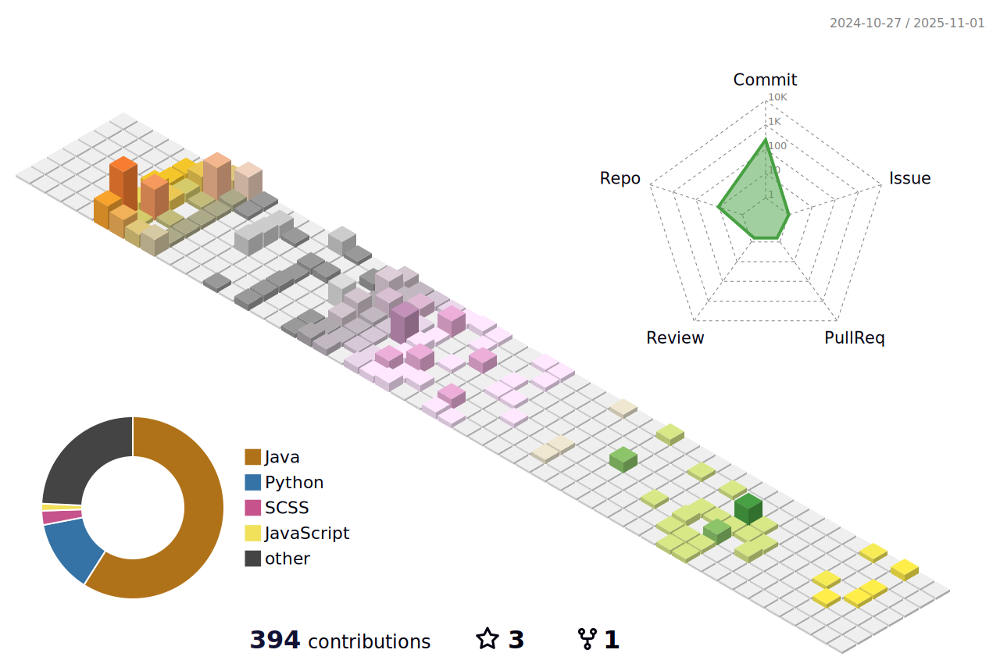

##  Hello! 

<!-- https://github.com/kyechan99/capsule-render -->

 
<!-- https://github.com/DenverCoder1/readme-typing-svg -->

 
 

 

<!-- https://github.com/anuraghazra/github-readme-stats -->

<!-- https://github.com/DenverCoder1/github-readme-streak-stats -->

 
<!-- https://github.com/Ashutosh00710/github-readme-activity-graph -->

<!-- https://github.com/tandpfun/skill-icons -->

 

 

 
 
 

  <b><i>The CRAZY man enjoys the world first~ </i></b> 

 <b><i>Learning while HOPING & HUSTLING!!!</i></b> 

<!-- https://github.com/kyechan99/capsule-render -->

